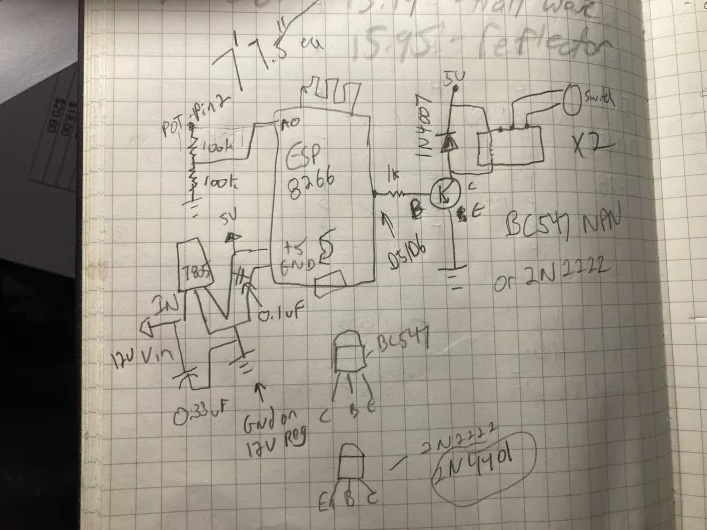

# ESP8266 Antenna AntennaRotator

This controls some relays in an antenna rotator box (I'm using the Yaesu G450A) and it reads the rheostat to figure out the position.

At the moment it just listens on the web for manual moves or a bearing, or it'll listen on UDP port 12060 for RUMLogNG's rotator commands. N1MM+ works if you change the default port to 12060.

## Schematic

The relays go across the switches such that they're simulating pressing the buttons.

The ESP8266 needs to have 64K of IRAM. A friend tried to use some of my code and his only had 32K so it wouldn't compile.

## TODO:
* Calibration on the web rather than hard coded
* Make it look nicer, e.g. an amizuthal map that can be uploaded
* Support more than just RUMLogNG and N1MM
* Better control logic since it'll often stop way too early
